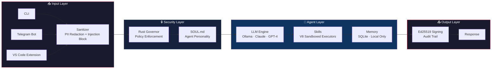

<div align="center">

# 🛡️ WRAP NEBULA

### _The AI agent kernel you can actually verify._

**Local-first. Zero-trust. Auditable by design.**

<p>
  <a href="https://github.com/Vitalcheffe/Wrap/stargazers"></a>
  <a href="https://github.com/Vitalcheffe/Wrap/network/members"></a>
  <a href="https://github.com/Vitalcheffe/Wrap/issues"></a>
  <a href="https://github.com/Vitalcheffe/Wrap/blob/main/LICENSE"></a>
</p>

<p>
  
  
  
  
</p>

<p>
  
  
  
</p>

<p>
  <a href="https://t.me/amnox271"></a>
  <a href="https://github.com/Vitalcheffe"></a>
</p>


</div>

---

> [!IMPORTANT]
> **Every AI coding agent sends your code to the cloud. No sandbox. No audit trail. No cryptographic guarantees.**
> WRAP NEBULA does the opposite. Your code **never** leaves your machine.

---

## 🚀 What is WRAP NEBULA?

WRAP NEBULA is a **local-first AI agent kernel** that runs entirely on your machine. It provides a secure, auditable, and sandboxed execution environment for AI agents — with a Rust-powered policy governor, V8 isolate sandboxes, and Ed25519-signed audit trails.

<div align="center">



</div>

Every message flows through this layered pipeline. **Compromising one layer does not compromise the others.**

---

## ⚔️ Why WRAP NEBULA?

<div align="center">

| Feature | Kilo | Cline | Cursor | **WRAP NEBULA** |
|:---|:---:|:---:|:---:|:---:|
| **Sandboxed Execution** | ❌ | ❌ | ❌ | ✅ V8 Isolate |
| **Audit Trail** | ❌ | ❌ | ❌ | ✅ Ed25519 Signed |
| **PII Redaction** | ❌ | ❌ | ❌ | ✅ Automatic |
| **Local-First** | partial | partial | ❌ | ✅ **Default** |
| **Zero Cloud Dependency** | ❌ | ❌ | ❌ | ✅ **Total** |
| **Free Forever** | ❌ | ❌ | ❌ | ✅ **MIT** |
| **Telegram Interface** | ❌ | ❌ | ❌ | ✅ **Built-in** |
| **VS Code Extension** | ✅ | ✅ | ✅ | ✅ **Included** |
| **Multi-LLM Support** | partial | partial | ❌ | ✅ **Ollama/Claude/GPT-4** |
| **Rust Policy Engine** | ❌ | ❌ | ❌ | ✅ **Governor** |

</div>

---

## 🏗️ Architecture

<div align="center">

```
┌─────────────────────────────────────────────────────────────────┐
│                        WRAP NEBULA                              │
├─────────────────────────────────────────────────────────────────┤
│                                                                 │
│  ┌──────────┐  ┌──────────┐  ┌──────────┐                      │
│  │   CLI    │  │ Telegram │  │ VS Code  │    INPUT SURFACES    │
│  └────┬─────┘  └────┬─────┘  └────┬─────┘                      │
│       │              │              │                            │
│       └──────────────┼──────────────┘                            │
│                      ▼                                          │
│  ┌──────────────────────────────────┐                           │
│  │         SANITIZER                │  ← PII redaction          │
│  │    injection blocking            │  ← prompt injection guard │
│  └──────────────┬───────────────────┘                           │
│                 ▼                                                │
│  ┌──────────────────────────────────┐                           │
│  │       RUST GOVERNOR              │  ← separate process       │
│  │    policy enforcement engine     │  ← survives agent crash   │
│  └──────────────┬───────────────────┘                           │
│                 ▼                                                │
│  ┌──────────────────────────────────┐                           │
│  │         AGENT CORE               │                           │
│  │  ┌─────────┐  ┌──────────────┐  │                           │
│  │  │ SOUL.md │→→│     LLM      │  │  ← Ollama / Claude / GPT  │
│  │  └─────────┘  └──────┬───────┘  │                           │
│  │                      ▼          │                           │
│  │  ┌─────────────────────────┐    │                           │
│  │  │    V8 SANDBOX SKILLS    │    │  ← 14 sandboxed executors │
│  │  │  web · code · file · …  │    │                           │
│  │  └─────────────────────────┘    │                           │
│  │                      ▼          │                           │
│  │         ┌────────────────┐      │                           │
│  │         │  SQLite Memory │      │  ← local only, encrypted  │
│  │         └────────────────┘      │                           │
│  └──────────────┬───────────────────┘                           │
│                 ▼                                                │
│  ┌──────────────────────────────────┐                           │
│  │      AUDIT & RESPONSE            │  ← Ed25519 signed         │
│  └──────────────────────────────────┘                           │
│                                                                 │
└─────────────────────────────────────────────────────────────────┘
```

</div>

---

## 🔥 Highlights

- 🏠 **[Local-First Gateway](https://github.com/Vitalcheffe/Wrap)** — your code, your machine, your rules. Zero cloud dependency by default.
- 🔒 **[Rust Governor](https://github.com/Vitalcheffe/Wrap/tree/main/crates/governor)** — a separate Rust process enforces policies. Even if the JS agent is compromised, the governor holds.
- 🧪 **[V8 Isolate Sandboxing](https://github.com/Vitalcheffe/Wrap/tree/main/packages/core)** — every skill runs in an isolated V8 context. No filesystem, no network, unless explicitly granted.
- ✍️ **[Ed25519 Audit Trail](https://github.com/Vitalcheffe/Wrap/blob/main/AUDIT.md)** — every agent response is cryptographically signed. Full chain of custody.
- 🔐 **[Automatic PII Redaction](https://github.com/Vitalcheffe/Wrap/blob/main/SECURITY.md)** — sensitive data is stripped before it ever reaches the LLM.
- 🤖 **[Multi-LLM Support](https://github.com/Vitalcheffe/Wrap)** — Ollama (local), Claude, GPT-4. Swap models without changing code.
- 📱 **[Telegram Bot](https://github.com/Vitalcheffe/Wrap)** — talk to your agent from anywhere. Fully encrypted.
- 💻 **[VS Code Extension](https://github.com/Vitalcheffe/Wrap/tree/main/apps/vscode)** — native IDE integration. Inline suggestions, code actions, and chat.
- 🖥️ **[War Room Dashboard](https://github.com/Vitalcheffe/Wrap/tree/main/apps/war-room)** — web UI for monitoring sessions, audit logs, and system health.
- 🧠 **[SOUL.md](https://github.com/Vitalcheffe/Wrap)** — define your agent's personality in plain markdown. No config hell.
- 📦 **[14 Sandbox Skills](https://github.com/Vitalcheffe/Wrap/tree/main/skills)** — web search, code execution, file ops, system info, memory, and more.
- 🔑 **[One-Line Install](https://github.com/Vitalcheffe/Wrap/blob/main/install.sh)** — `curl | bash` and you're running.

---

## 🛠️ Skills

14 sandboxed executors — each runs in a V8 isolate with **no filesystem or network access** unless explicitly granted:

<div align="center">

| Skill | Description | Access |
|:------|:------------|:-------|
| 🔍 `web.search` | DuckDuckGo scraping, no API key | Network (read-only) |
| 💻 `code.execute` | Sandboxed Python / JS / TS | None (pure compute) |
| 📂 `file.read` | Read workspace files | FS (workspace-scoped) |
| 📝 `file.write` | Write workspace files | FS (workspace-scoped) |
| 🖥️ `system.info` | CPU, memory, disk stats | System (read-only) |
| 🧠 `memory.search` | Semantic search over SQLite | DB (read-only) |
| 🧠 `memory.store` | Store new memories | DB (write) |
| 🌐 `web.fetch` | Fetch and parse URLs | Network (read-only) |
| 📊 `data.parse` | Parse JSON/CSV/XML | None (pure compute) |
| 🔐 `crypto.hash` | Hash and sign data | None (pure compute) |
| 📅 `time.now` | Get current time/timezone | None (pure compute) |
| 🧮 `math.calc` | Evaluate expressions | None (pure compute) |
| 📧 `email.read` | Read inbox (IMAP) | Network (IMAP) |
| 🗄️ `db.query` | Query local SQLite | DB (read-only) |

</div>

---

## 📁 Project Structure

<div align="center">

```
Wrap/
├── 📂 apps/
│   ├── 📂 vscode/              # VS Code extension
│   │   ├── src/                # Extension source
│   │   └── package.json
│   └── 📂 war-room/            # Web dashboard
│       ├── pages/              # Dashboard pages
│       └── components/
│
├── 📂 crates/
│   └── 📂 governor/            # 🔒 Rust policy engine
│       ├── src/                # Governor source
│       └── Cargo.toml
│
├── 📂 packages/
│   └── 📂 core/                # 🧠 Agent kernel
│       ├── src/
│       │   ├── agent/          # Agent loop & orchestration
│       │   ├── skills/         # Skill loader & definitions
│       │   ├── memory/         # SQLite memory layer
│       │   ├── audit/          # Ed25519 signing
│       │   └── sanitizer/      # PII redaction
│       └── package.json
│
├── 📂 skills/
│   └── 📂 default/             # Built-in skill definitions
│
├── 📂 policy/                  # Governance policy files
├── 📂 scripts/                 # Install & utility scripts
├── 📂 docs/                    # Documentation
├── 📂 tests/                   # Integration tests
│
├── 🔧 install.sh               # One-line installer
├── 📋 AUDIT.md                 # Audit trail documentation
├── 🔒 SECURITY.md              # Security policy
├── 🤝 CONTRIBUTING.md          # Contribution guidelines
└── 📄 LICENSE                  # MIT
```

</div>

---

## 🚀 Quick Start

### One-Line Install

```bash
curl -fsSL https://raw.githubusercontent.com/Vitalcheffe/Wrap/main/install.sh | bash
```

### Manual Setup

```bash
# Clone the repo
git clone https://github.com/Vitalcheffe/Wrap.git
cd Wrap

# Install dependencies
npm install

# (Optional) Build the Rust Governor
cd crates/governor && cargo build --release && cd ../..

# Authenticate with your LLM provider
nebula auth login anthropic

# Start the agent
nebula start
```

### Prerequisites

<div align="center">

| Requirement | Version | Required? |
|:------------|:--------|:---------:|
| **Node.js** | 18+ | ✅ |
| **npm** | 9+ | ✅ |
| **Rust** | 1.70+ | Optional (Governor) |
| **Ollama** | Latest | For local LLM |

</div>

---

## 🔒 Security Model

> [!NOTE]
> WRAP NEBULA's security is **defense in depth**. Every layer is independent.

| Layer | Technology | What It Does |
|:------|:-----------|:-------------|
| **Sandbox** | V8 Isolates | Each skill runs in complete isolation — no filesystem, no network, no shared memory |
| **Governor** | Rust (separate process) | Policy enforcement that survives agent crashes. Written in Rust, not JavaScript |
| **Audit** | Ed25519 | Every response is cryptographically signed. Full chain of custody |
| **PII Shield** | Automatic | Sensitive data (emails, phones, keys, tokens) stripped before reaching the LLM |
| **Local-First** | SQLite + local filesystem | No data leaves your machine unless you explicitly configure a cloud LLM |

---

## 🔌 Connection Modes

| Mode | Use Case | Setup |
|:-----|:---------|:------|
| 💻 **CLI** | Direct terminal usage | `nebula` |
| 🔌 **VS Code** | IDE-native experience | Install from `apps/vscode/` |
| 📱 **Telegram** | Remote agent control | Connect your bot token |
| 🖥️ **War Room** | Web monitoring dashboard | `http://localhost:3000` |

---

## 🤝 Contributing

**Contributions are what make the open-source community such an amazing place to learn, inspire, and create.**

1. **Fork** the Project
2. **Create** your Feature Branch
   ```bash
   git checkout -b feature/AmazingFeature
   ```
3. **Commit** your Changes
   ```bash
   git commit -m 'feat: add AmazingFeature'
   ```
4. **Push** to the Branch
   ```bash
   git push origin feature/AmazingFeature
   ```
5. **Open** a Pull Request

See [CONTRIBUTING.md](CONTRIBUTING.md) for detailed guidelines, code style, and skill development docs.

---

## 📊 Stats

<div align="center">


[](https://www.star-history.com/#Vitalcheffe/Wrap&type=date)

</div>

---

## 📄 License

Distributed under the **MIT License**. See [`LICENSE`](LICENSE) for more information.
**Free forever.** No paywalls, no premium tiers, no "Contact Sales."

---

<div align="center">

### Made with ❤️, 🦀, and 🛡️ by [Amine Harch el Korane](https://github.com/Vitalcheffe)

_The AI agent you can actually trust._


</div>
